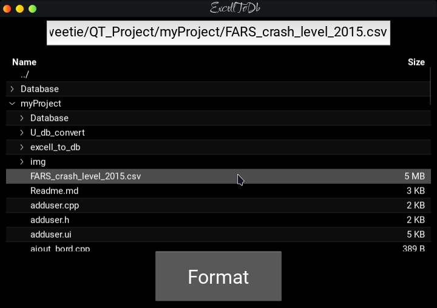

# SUIVI DES INSCRIPTIONS ET REINSCRIPTIONS ADMINISTRATIVES AU SEIN DE L'ENI (PROJET No22 DE MR RALAIVAO)

## Description

Notre projet a pour theme [la gestion de l'inscription et de la reinscription a l'ENI](main.cpp)

C'est une application desktop qui sert:

* A visionner les suivi financier, c'est-à-dire la liste des etudiants, invité à s'inscrire et/ou autorisé à s'inscrire pédagogiquement, avec leur montant payé pour le droit d'inscription

* A visionner la situation financière de l'ecole au niveau de l'inscription et la reinscription

* A mieux gerer les payements et les echelonnements(à l'aide des filtres de l'option d'ajout de payement et aussi l'accord d'autorisation à entamer l'echelonnement)

* Pour preuve de payement(qui est rendu transparent grâce à la presence de l'historique)

Ce projet a été developpé avec *QT c++* et *python kivy* pour le frontend, *sqlite* pour le database et *c++* et *python pandas* pour le backend.
  
### Pourquoi avoir utilisé ces technologies?

*Qt* est largement utilisé par les grands entreprises(KDE, Adobe Photoshop Album, Google Earth, VLC, ...)

*C++* est très adapté pour le developpement backend

*python pandas* nous a permis de generer un database à partir d'un fichier excell, ou csv, ou json, ou xml, pour faciliter l'ajout des données annuelles lors de son deploiement et utilisation

*python kivy* nous a permis d'offrir une interface graphique pour l'application qui genère le database

*sqlite* est le plus adapté pour Qt à la gestion des databases

   

## Dépendence et requis

Puisque l'application n'est pas encore generé en executable, vous auriez vesion de Qt creator, qui est disponible sur le site officiel de  [Qt](https://www.qt.io/) pour le lancer

Par contre, l'application kivy, genenrateur de database, a déjà son executable sur linux seulement... Celui pour windows, sera déployé à l'avenir

   

## Utilisation

Ouvrez le dossier de projet dans Qt creator et lancez l'application en appuiyant sur *Ctrl+R*

Une fois ouverte, vous serez redirigés  dans une fenêtre de login, ce qui veut dire que notre application est sécurisée et que seuls les utilisateurs enregistré peuvent y acceder... 

<picture>
    <source media="(prefers-color-scheme: light)" src="./img/login.png"width="400px" height="400px" >
    <source media="(prefers-color-scheme: dark)" src="./img/login.png" width="400px" height="400px">
    
</picture>

    
Après avoir entrer le nom et le mot de passe de l'utilisateur; vous seriez redirigés vers la fenêtre menu où il y a des boutons mènant vers les differentes activités disponibles dans l'application

<picture>
    <source media="(prefers-color-scheme: light)" src="./img/menu.png"width="400px" height="400px" >
    <source media="(prefers-color-scheme: dark)" src="./img/menu.png" width="400px" height="400px">
    
</picture>

    

L'icon *user* en haut à  droite vous redirigera vers votre profil, là où vous pouvez changer votre mot de passe qui est par défaut imposé  par l'administrateur lors de votre ajout

<picture>
    <source media="(prefers-color-scheme: light)" src="./img/profile.png"width="350px" height="350px" >
    <source media="(prefers-color-scheme: dark)" src="./img/profile.png" width="350px" height="350px">
    
</picture>
    

L'icon *sql* en haut à gauche ouvrira l'application générateur de database. Cependant, il faut que le fichier excell(ou csv ou json ou xml), soit du même structure que le database d'origine sinon l'application ne pourra pas être accessible

<picture>
    <source media="(prefers-color-scheme: light)" src="./img/U_db_convert.png"width="400px" height="400px" >
    <source media="(prefers-color-scheme: dark)" src="./img/U_db_convert.png" width="400px" height="400px">
    
</picture>

    

La première option dans le menu s'appelle *Suivi financier*. Elle nous permet de visionner la liste des étudiants avec le montant que chacun a payé pour le droit d'inscription

Cette liste peut être filtrée  en fonction:

* du type: liste génerale, liste des invités à  s'inscrire(c'est-à-dire les admis aux concours), liste des autorisés pedagogiquement à s'inscrire(c'est-à-dire les admis au niveau supérieur et les redoublants')

* du niveau: L1, L2, L3, M1, M2, Doctorants

* du status de payement: payé, payé partiellement, non-payé

On vous offre la possibilité d'enregistrer une liste personnalisée dans un fichier txt en cliquant sur le boutton *save* et vous pouvez le renommer si vous voulez ou bien laisser le champ de texte vide pour un nom par défaut

<picture>
    <source media="(prefers-color-scheme: light)" src="./img/suivi.png"width="400px" height="400px" >
    <source media="(prefers-color-scheme: dark)" src="./img/suivi.png" width="400px" height="400px">
    
</picture>

    

Dans la deuxième option se trouve l'ajout de payement; vous allez entrer dans le champ tout en haut le numero matricule de l'etudiant et ses informations seront affichées; vous verifiez bien si c'est l'etudiant correspondant et vous ajouteriez après le montant et le numero de bordereau de l'etudiant pour pouvoir confirmer en suite l'enregistrement du payement
  

<picture>
    <source media="(prefers-color-scheme: light)" src="./img/payment.png"width="400px" height="400px" >
    <source media="(prefers-color-scheme: dark)" src="./img/payment.png" width="400px" height="400px">
    
</picture>

    

La troisième option ne peut être accedée que par les administrateurs. Elle permet à ces derniers de visionner et de gerer(ajouter, modifier, supprimer) les utilisateurs de l'application

  

<picture>
    <source media="(prefers-color-scheme: light)" src="./img/users.png"width="400px" height="400px" >
    <source media="(prefers-color-scheme: dark)" src="./img/users.png" width="400px" height="400px">
    
</picture>

    

La quatrième consiste, pour les utilisateurs simples et les administrateurs, d'envoyer des demandes d'echellonnement, et seulement pour les administrateurs, d'accepter les demandes, pour que l'etudiant en question puisse, ensuite, payer partiellement le droit d'inscription dans un délai donné

  

<picture>
    <source media="(prefers-color-scheme: light)" src="./img/echelonnement.png"width="400px" height="400px" >
    <source media="(prefers-color-scheme: dark)" src="./img/echelonnement.png" width="400px" height="400px">
    
</picture>

    

La cinquième option affiche toutes les activités effectuées par chaque utilisateur... Pas même les administrateurs ont le droit de modifier ni supprimer ses contenus

  

<picture>
    <source media="(prefers-color-scheme: light)" src="./img/historic.png"width="400px" height="400px" >
    <source media="(prefers-color-scheme: dark)" src="./img/historic.png" width="400px" height="400px">
    
</picture>

    

L'avant dernière option sert à visionner la situation financière de l'école dans le domaine de l'inscription, à  l'aide d'un *pie chart*

  

<picture>
    <source media="(prefers-color-scheme: light)" src="./img/situation.png"width="400px" height="400px" >
    <source media="(prefers-color-scheme: dark)" src="./img/situation.png" width="400px" height="400px">
    
</picture>

    

## Perspective

Si bien que cette application est prête à être utiliser, nous avons prévu de l'améliorer encore plus en:

* La rendant executable dans tout systeme d'exploitation

* Améliorant la performance de l'application générateur de database

* La rendant multi-utilisateur sur différents appareils connectés et synchronisés

   

## A propos

Projet de fin d'année no22 de Mr Ralaivao

Encadreur: **Mr Josué**

Membres de l'équipe en *L1 GS 2020*:

- RAVELOSON Radosetra Mickaël 2383

- RAMIARAMANANA Sompitriniaina To Désiré 2405 

- VONIARIMALALA Fiaro Miangaly 2381

- ANDRIANARIVONY Zo Michaël 2382
